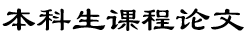

 

$\\ \quad \\$
**学年，学期：$\underline{\qquad\qquad\qquad2018-2019秋冬\qquad\qquad\qquad}$
$\\ \quad $**
**课 程 名 称：$\underline{\qquad\qquad\qquad\qquad军事理论\qquad\qquad\qquad\qquad}$
$\\ \quad $**
**姓$\qquad\,\,\,$名：$\underline{\qquad\qquad\qquad\qquad彭子帆\qquad\qquad\qquad\qquad}$**